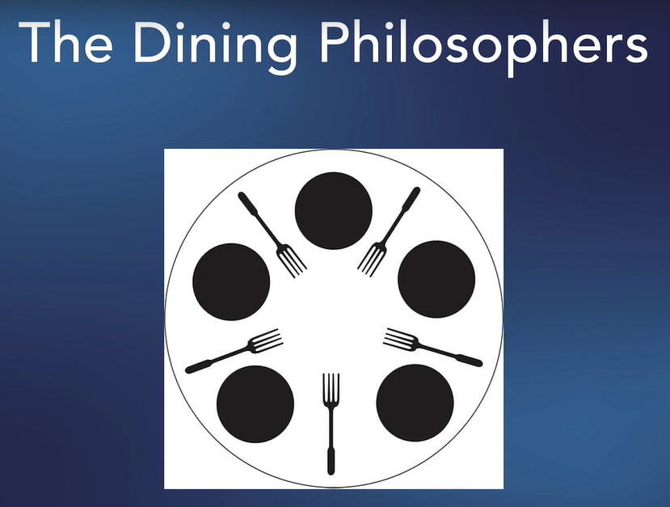

# 🚀 Concurrencia en Go: Una Guía Completa

## 🗺️ Mapa de Conceptos: Concurrencia en Go

A continuación te presento una visión general de los conceptos fundamentales que exploraremos en este documento:

### 📊 Conceptos Fundamentales

- **Concurrencia vs Paralelismo** ➡️ Gestionar múltiples tareas en progreso vs ejecutar tareas simultáneamente
- **Goroutines** ➡️ Funciones que se ejecutan concurrentemente, más ligeras que los hilos tradicionales
- **Sincronización** ➡️ Coordinar la ejecución entre goroutines para evitar problemas

### 🛠️ Herramientas de Sincronización

1. **WaitGroups** ➡️ Esperar a que múltiples goroutines terminen
2. **Mutexes** ➡️ Proteger el acceso a datos compartidos
3. **Channels** ➡️ Comunicar y transferir datos entre goroutines

### 🧩 Patrones de Concurrencia

- **Productor-Consumidor** ➡️ Coordinación entre generadores y procesadores de datos
- **Filósofos Comensales** ➡️ Gestión de recursos compartidos evitando deadlocks
- **Fan-out/Fan-in** ➡️ Distribución y recolección de trabajo paralelo
- **Worker Pools** ➡️ Grupo de goroutines que procesan tareas de una cola

### ⚠️ Problemas Comunes

- **Race Conditions** ➡️ Acceso simultáneo descoordinado a datos compartidos
- **Deadlocks** ➡️ Bloqueo mutuo donde todas las goroutines quedan esperando
- **Goroutines Huérfanas** ➡️ Goroutines que nunca terminan

### 🔍 Herramientas de Diagnóstico

- **Race Detector** ➡️ `go run -race` o `go test -race` para detectar problemas
- **Pprof** ➡️ Perfilador para identificar cuellos de botella

Este documento te llevará desde los conceptos básicos hasta patrones avanzados con ejemplos prácticos, consejos de implementación y soluciones a problemas clásicos de concurrencia. Cada sección está diseñada para construir sobre la anterior, proporcionándote una comprensión completa de cómo Go maneja la concurrencia de forma elegante y eficiente.

# 🔄 La Filosofía de Concurrencia en Go: Un Resumen

## 🧠 La Visión de los Creadores

Go fue diseñado desde el principio para abordar los desafíos de la programación concurrente y distribuida en un mundo cada vez más paralelo. Los creadores de Go (Rob Pike, Ken Thompson y Robert Griesemer) tenían una visión clara: **hacer que la concurrencia sea accesible, práctica y segura**.

## 🛠️ Las Herramientas Principales y su Filosofía

### 1️⃣ Goroutines: Concurrencia Ligera

**💡 Idea central**: Hacer que la concurrencia sea tan simple como añadir una palabra clave.

- **Extremadamente ligeras**: Miles de goroutines pueden ejecutarse en un solo hilo del sistema operativo
- **Programación automática**: El runtime de Go se encarga de distribuir goroutines entre hilos
- **Sintaxis simple**: Solo añade `go` antes de una llamada a función

```go
go function() // ¡Así de simple!
```

### 2️⃣ Channels: Comunicación Estructurada

**💡 Idea central**: "No comuniques compartiendo memoria; comparte memoria comunicándote."

- **Paso de mensajes tipados**: Transferencia segura de datos entre goroutines
- **Sincronización integrada**: Coordinación automática entre emisor y receptor
- **Concepto de propiedad**: Canales facilitan la transferencia clara de "propiedad" de datos

```go
ch := make(chan int)
ch <- 42         // Envía dato (puede bloquear)
value := <-ch    // Recibe dato (puede bloquear)
```

### 3️⃣ Select: Multiplexación Elegante

**💡 Idea central**: Manejar múltiples canales de comunicación de forma no determinista.

- **Coordinación multi-canal**: Esperar por múltiples operaciones de canales
- **Timeout y cancelación**: Patrones integrados para control de tiempo y finalización
- **No determinismo controlado**: Selección aleatoria cuando múltiples casos están disponibles

```go
select {
    case msg := <-ch1:
        // Manejar mensaje de ch1
    case ch2 <- value:
        // Enviar a ch2
    case <-time.After(1 * time.Second):
        // Timeout después de 1 segundo
}
```

### 4️⃣ Paquete sync: Control de Bajo Nivel

**💡 Idea central**: Proporcionar primitivas de sincronización cuando los canales no son suficientes.

- **WaitGroup**: Coordinar la finalización de múltiples goroutines
- **Mutex/RWMutex**: Proteger acceso a datos compartidos (cuando sea necesario)
- **Once**: Garantizar que una operación se ejecute exactamente una vez
- **Pool**: Reutilizar recursos costosos
- **Cond**: Variables de condición para situaciones complejas

```go
var wg sync.WaitGroup
wg.Add(5)      // Esperaremos 5 goroutines
go func() {
    defer wg.Done()  // Decrementa el contador
    // ...trabajo...
}()
wg.Wait()      // Bloquea hasta que el contador llegue a cero
```

## 🧩 Cómo Encajan Estas Piezas: La Gran Imagen

Los creadores de Go visualizaron un sistema donde:

1. **Las goroutines son la unidad básica de concurrencia**: pequeñas, independientes y fáciles de crear.

2. **Los channels son la forma primaria de comunicación**: la transferencia explícita de datos es preferible a los estados compartidos y complejos sistemas de bloqueo.

3. **El paquete sync complementa, no reemplaza**: cuando necesitas sincronización de bajo nivel, está disponible pero no es el enfoque principal.

## 📚 Principios Guía

### 1. Simplicidad sobre complejidad

Go evita abstracciones complejas (como promesas, futuros o callbacks anidados) en favor de un modelo mental simple.

### 2. Composición sobre jerarquía

Las goroutines y channels pueden combinarse en patrones potentes sin necesidad de frameworks complejos.

### 3. Explícito es mejor que implícito

La sincronización y comunicación son claras y visibles en el código, no ocultas en abstracciones.

### 4. Pragmatismo

Go proporciona tanto canales (modelo CSP) como primitivas de sincronización tradicionales (mutex), reconociendo que diferentes problemas necesitan diferentes herramientas.

## 🌉 De la Teoría a la Práctica: Patrones Emergentes

Los patrones de concurrencia en Go surgieron naturalmente de estas herramientas:

- **Worker Pools**: Grupos de goroutines consumiendo tareas de un canal
- **Fan-out/Fan-in**: Distribución y recolección de trabajo entre múltiples goroutines
- **Pipelines**: Etapas conectadas por canales para procesar flujos de datos
- **Cancelación por context**: Propagación de señales de cancelación a través de árboles de llamadas

## 💡 La Clave del Éxito: El Modelo de Concurrencia de Go

Lo que hace especial al modelo de concurrencia de Go es su **equilibrio entre poder y simplicidad**:

- Suficientemente **poderoso** para construir sistemas distribuidos complejos
- Suficientemente **simple** para ser entendido y usado correctamente
- Suficientemente **seguro** para evitar errores comunes de concurrencia
- Suficientemente **eficiente** para escalar a miles de goroutines

La concurrencia en Go no es solo un conjunto de herramientas, sino una **filosofía**:

> "Go no intenta resolver todos los problemas de concurrencia, pero ofrece un conjunto coherente y práctico de primitivas que permiten abordar una amplia gama de problemas concurrentes de manera eficiente y con menos errores."

Esta filosofía pragmática, combinada con herramientas bien diseñadas, hace que la programación concurrente en Go sea notablemente más accesible y robusta que en muchos otros lenguajes.

## 🌟 Introducción a la Concurrencia

La concurrencia es uno de los puntos fuertes de Go y una razón clave por la que muchos desarrolladores eligen este lenguaje. Pero, ¿qué es exactamente?

**La concurrencia** es la capacidad de un programa para manejar múltiples tareas en progreso al mismo tiempo. Es importante distinguirla del paralelismo:

- **Concurrencia** ➡️ Gestionar múltiples tareas en curso (no necesariamente ejecutándose exactamente al mismo tiempo)
- **Paralelismo** ➡️ Ejecutar múltiples tareas simultáneamente (requiere múltiples procesadores)

> 💡 **Analogía**: La concurrencia es como un chef que prepara varios platos a la vez. Mientras uno se hornea, está cortando verduras para otro. No está haciendo todo literalmente al mismo tiempo, pero avanza con todas las tareas eficientemente.

En Go, la concurrencia se implementa principalmente mediante **goroutines** y **channels**. En esta guía nos centraremos en goroutines y su sincronización.

## 🧵 Goroutines: El Núcleo de la Concurrencia en Go

Las goroutines son funciones que se ejecutan concurrentemente con otras goroutines, incluyendo la función principal (`main`). Son extremadamente ligeras - puedes crear miles de ellas sin problemas.

### Creación de Goroutines

Para ejecutar una función como goroutine, simplemente añade la palabra clave `go` antes de la llamada:

```go
package main

import (
    "fmt"
    "time"
)

func main() {
    // Ejecutamos la función como goroutine
    go sayHello()

    // Esperamos para dar tiempo a que la goroutine se ejecute
    time.Sleep(1 * time.Second)
    fmt.Println("Programa terminado")
}

func sayHello() {
    fmt.Println("¡Hola, mundo concurrente!")
}
```

### ⚠️ El Problema de la Sincronización

En el ejemplo anterior, usamos `time.Sleep()` para dar tiempo a que la goroutine termine. Esto es una **mala práctica** por varias razones:

1. No sabemos cuánto tiempo exactamente necesita la goroutine
2. Es ineficiente esperar un tiempo arbitrario
3. En situaciones complejas, este enfoque se vuelve inmanejable

Veamos otro ejemplo:

```go
package main

import (
    "fmt"
    "time"
)

func printSomething(s string) {
    fmt.Println(s)
}

func main() {
    words := []string{
        "alpha", "beta", "gamma", "delta", "phi",
        "zeta", "eta", "theta", "epsilon",
    }

    // Lanzamos múltiples goroutines
    for i, word := range words {
        go printSomething(fmt.Sprintf("%d: %s", i, word))
    }

    // Esperamos arbitrariamente - ¡mala práctica!
    time.Sleep(1 * time.Second)
}
```

Al ejecutar este código, notarás que:

1. Las palabras no se imprimen en orden
2. No tenemos garantía de que todas las goroutines terminen antes del `time.Sleep`

## 🔄 WaitGroup: Sincronizando Goroutines

Para resolver el problema de sincronización, Go proporciona `sync.WaitGroup`. Un WaitGroup espera a que un conjunto de goroutines finalice, actuando como un contador:

```go
package main

import (
    "fmt"
    "sync"
)

func printSomething(wg *sync.WaitGroup, s string) {
    // Indicamos que esta goroutine ha terminado cuando la función finalice
    defer wg.Done()
    fmt.Println(s)
}

func main() {
    // Creamos un WaitGroup
    var wg sync.WaitGroup

    words := []string{
        "alpha", "beta", "gamma", "delta", "phi",
        "zeta", "eta", "theta", "epsilon",
    }

    // Indicamos cuántas goroutines vamos a esperar
    wg.Add(len(words))

    for i, word := range words {
        go printSomething(&wg, fmt.Sprintf("%d: %s", i, word))
    }

    // Bloqueamos hasta que todas las goroutines terminen
    wg.Wait()
    fmt.Println("¡Todas las goroutines han terminado!")
}
```

### 🛠️ Métodos principales de WaitGroup

1. **`wg.Add(n)`**: Incrementa el contador en `n` (número de goroutines a esperar)
2. **`wg.Done()`**: Decrementa el contador en 1 (una goroutine ha terminado)
3. **`wg.Wait()`**: Bloquea hasta que el contador llegue a 0 (todas han terminado)

> ⚠️ **Advertencia**: Asegúrate de que los valores de `Add()` y `Done()` estén equilibrados. Un exceso de `Add()` causará un deadlock, y un exceso de `Done()` podría causar un panic.

## 🧪 Testing con Goroutines

Probar código concurrente puede ser desafiante. Una forma de probar funciones que usan goroutines es capturar su salida:

```go
package main

import (
    "fmt"
    "io"
    "os"
    "strings"
    "sync"
    "testing"
)

func Test_printSomething(t *testing.T) {
    // Guardamos stdout original
    originalStdout := os.Stdout

    // Creamos un pipe para capturar la salida
    r, w, _ := os.Pipe()
    os.Stdout = w

    // Preparamos el WaitGroup
    var wg sync.WaitGroup
    wg.Add(1)

    // Ejecutamos la función como goroutine
    go printSomething(&wg, "Mensaje de prueba")

    // Esperamos a que termine
    wg.Wait()

    // Cerramos la escritura del pipe
    w.Close()

    // Leemos lo que se imprimió
    var buf strings.Builder
    io.Copy(&buf, r)
    output := buf.String()

    // Restauramos stdout
    os.Stdout = originalStdout

    // Verificamos la salida
    expected := "Mensaje de prueba"
    if !strings.Contains(output, expected) {
        t.Errorf("Esperaba '%s', pero obtuve '%s'", expected, output)
    }
}
```

## 🔍 Patrones Comunes y Errores a Evitar

### Errores comunes:

1. **Race conditions**: Cuando múltiples goroutines acceden a la misma variable

   ```go
   // Incorrecto - race condition
   var counter int
   go func() { counter++ }()
   go func() { counter++ }()
   ```

2. **Deadlocks**: Cuando todas las goroutines están esperando y ninguna puede avanzar

   ```go
   // Incorrecto - deadlock
   var wg sync.WaitGroup
   wg.Add(1)
   // Olvidamos llamar a wg.Done()
   wg.Wait() // ¡Se bloqueará para siempre!
   ```

3. **Goroutines huérfanas**: Goroutines que continúan ejecutándose después de que main termina

### Buenas prácticas:

1. **Usa `sync.Mutex` para proteger datos compartidos**:

   ```go
   var (
       counter int
       mu      sync.Mutex
   )

   func incrementCounter() {
       mu.Lock()
       defer mu.Unlock()
       counter++
   }
   ```

2. **Pasa el WaitGroup por referencia, no por valor**:

   ```go
   func worker(wg *sync.WaitGroup) { // ✅ Correcto
       defer wg.Done()
       // ...
   }
   ```

3. **Usa `go vet` y `go run -race` para detectar problemas**:
   ```bash
   go vet ./...
   go run -race main.go
   ```

## 💪 Desafío: Implementando Concurrencia

Modifica este código para que use goroutines y WaitGroups adecuadamente:

```go
package main

import (
    "fmt"
)

var msg string

func updateMessage(s string) {
    msg = s
}

func printMessage() {
    fmt.Println(msg)
}

func main() {
    msg = "Hello, world!"

    updateMessage("Hello, universe!")
    printMessage()

    updateMessage("Hello, cosmos!")
    printMessage()

    updateMessage("Hello, world!")
    printMessage()
}
```

### ✅ Solución

```go
package main

import (
    "fmt"
    "sync"
)

var msg string
var mu sync.Mutex  // Para proteger accesos concurrentes a 'msg'

func updateMessage(wg *sync.WaitGroup, s string) {
    defer wg.Done()

    mu.Lock()
    msg = s
    mu.Unlock()
}

func printMessage() {
    mu.Lock()
    fmt.Println(msg)
    mu.Unlock()
}

func main() {
    var wg sync.WaitGroup

    // Mensaje inicial
    msg = "Hello, world!"

    // Primer cambio
    wg.Add(1)
    go updateMessage(&wg, "Hello, universe!")
    wg.Wait()
    printMessage()

    // Segundo cambio
    wg.Add(1)
    go updateMessage(&wg, "Hello, cosmos!")
    wg.Wait()
    printMessage()

    // Tercer cambio
    wg.Add(1)
    go updateMessage(&wg, "Hello, world!")
    wg.Wait()
    printMessage()
}
```

### 🧪 Test para la solución

```go
package main

import (
    "bytes"
    "io"
    "os"
    "strings"
    "sync"
    "testing"
)

func Test_updateMessage(t *testing.T) {
    var wg sync.WaitGroup

    // Estado inicial
    oldMsg := msg
    newMsg := "Test message"

    // Actualizamos el mensaje
    wg.Add(1)
    go updateMessage(&wg, newMsg)
    wg.Wait()

    if msg != newMsg {
        t.Errorf("updateMessage() = %v, quería %v", msg, newMsg)
    }

    // Restauramos el estado
    msg = oldMsg
}

func Test_printMessage(t *testing.T) {
    // Guardamos stdout original
    oldStdout := os.Stdout
    r, w, _ := os.Pipe()
    os.Stdout = w

    // Establecemos un mensaje conocido
    testMsg := "Test output message"
    msg = testMsg

    // Llamamos a la función
    printMessage()

    // Restauramos stdout
    w.Close()
    os.Stdout = oldStdout

    // Leemos la salida
    var out bytes.Buffer
    io.Copy(&out, r)

    // Verificamos
    if !strings.Contains(out.String(), testMsg) {
        t.Errorf("printMessage() = %v, quería %v", out.String(), testMsg)
    }
}

func Test_fullProgram(t *testing.T) {
    // Guardamos stdout
    oldStdout := os.Stdout
    r, w, _ := os.Pipe()
    os.Stdout = w

    // Ejecutamos el programa
    main()

    // Restauramos stdout
    w.Close()
    os.Stdout = oldStdout

    // Leemos la salida
    var out bytes.Buffer
    io.Copy(&out, r)
    output := out.String()

    // Verificamos las tres líneas
    expected := []string{
        "Hello, universe!",
        "Hello, cosmos!",
        "Hello, world!",
    }

    for _, exp := range expected {
        if !strings.Contains(output, exp) {
            t.Errorf("main() debería imprimir '%s'", exp)
        }
    }
}
```

# 🔄 Race Conditions, Mutexes y Channels en Go

## 🚫 Race Conditions: El Gran Problema

Una **race condition** ocurre cuando dos o más goroutines acceden a la misma memoria simultáneamente y al menos una está escribiendo. Esto causa comportamientos impredecibles y errores difíciles de detectar.

> 💡 **Analogía**: Imagina dos personas escribiendo en la misma línea de un documento al mismo tiempo. El resultado será una mezcla confusa de ambas escrituras.

Veamos un ejemplo clásico de race condition:

```go
package main

import (
    "fmt"
    "sync"
)

func main() {
    counter := 0
    var wg sync.WaitGroup

    // Lanzamos 1000 goroutines que incrementan el contador
    for i := 0; i < 1000; i++ {
        wg.Add(1)
        go func() {
            defer wg.Done()
            counter++ // ⚠️ RACE CONDITION: múltiples goroutines modifican 'counter'
        }()
    }

    wg.Wait()
    fmt.Println("Valor final:", counter) // Casi nunca será 1000
}
```

Si ejecutas este código varias veces, obtendrás diferentes resultados. Esto ocurre porque `counter++` no es una operación atómica, sino que implica:

1. Leer el valor actual de counter
2. Incrementarlo en 1
3. Escribir el nuevo valor en counter

Cuando múltiples goroutines ejecutan estos pasos simultáneamente, pueden pisar los cambios de las demás.

## 🔒 Mutexes: Protegiendo Recursos Compartidos

`Mutex` significa "Mutual Exclusion" (Exclusión Mutua). Es una estructura que permite que **solo una goroutine acceda a un código o recurso a la vez**.

### Cómo funciona un Mutex

Un mutex tiene dos operaciones principales:

- **Lock()**: Adquiere el bloqueo (si otra goroutine ya lo tiene, espera)
- **Unlock()**: Libera el bloqueo para que otras goroutines puedan adquirirlo

Corrigiendo el ejemplo anterior:

```go
package main

import (
    "fmt"
    "sync"
)

func main() {
    counter := 0
    var wg sync.WaitGroup
    var mu sync.Mutex // 🔒 Creamos un mutex

    for i := 0; i < 1000; i++ {
        wg.Add(1)
        go func() {
            defer wg.Done()

            mu.Lock()   // 🔒 Bloqueamos - solo esta goroutine puede acceder
            counter++
            mu.Unlock() // 🔓 Liberamos para que otras goroutines puedan acceder
        }()
    }

    wg.Wait()
    fmt.Println("Valor final:", counter) // Ahora siempre será 1000
}
```

### Patrón común con Mutex

Un patrón muy común es usar `defer` con `Unlock()`:

```go
mu.Lock()
defer mu.Unlock()
// código que accede a recursos compartidos
```

Esto garantiza que el mutex se libere incluso si ocurre un panic o return temprano.

## 📝 Ejemplo Práctico con Mutex

```go
package main

import (
    "fmt"
    "sync"
)

var msg string
var wg sync.WaitGroup

func updateMessage(s string, mu *sync.Mutex) {
    defer wg.Done()

    mu.Lock()         // 🔒 Bloqueamos acceso exclusivo a msg
    msg = s           // Modificamos la variable compartida
    mu.Unlock()       // 🔓 Liberamos el acceso
}

func main() {
    msg = "Hello, world!"
    var mu sync.Mutex

    wg.Add(2)
    go updateMessage("Hello, universe!", &mu)
    go updateMessage("Hello, cosmos!", &mu)
    wg.Wait()

    // El resultado será uno de los dos mensajes, pero sin race condition
    fmt.Println(msg)
}
```

### 🔍 Detectando Race Conditions

Go incluye un detector de race conditions integrado. Para usarlo:

```bash
# Al ejecutar un programa
go run -race tuarchivo.go

# Al ejecutar tests
go test -race ./...
```

El detector agregará instrumentación al código que identifica posibles race conditions durante la ejecución.

## 📊 Un Ejemplo Más Complejo: Sistema de Ingresos

Veamos un ejemplo que simula ingresos semanales desde diferentes fuentes:

```go
package main

import (
    "fmt"
    "sync"
)

var wg sync.WaitGroup

type Income struct {
    Source string
    Amount int
}

func main() {
    // Variable para el saldo bancario
    var bankBalance int
    var balanceMutex sync.Mutex

    // Mostramos el saldo inicial
    fmt.Printf("Starting bank balance: $%d\n", bankBalance)

    // Definimos fuentes de ingreso semanales
    incomes := []Income {
        {Source: "Main job", Amount: 500},
        {Source: "Side hustle", Amount: 200},
        {Source: "Freelance project", Amount: 50},
        {Source: "Selling stuff online", Amount: 100},
    }
    wg.Add(len(incomes))

    // Simulamos 52 semanas de ingresos para cada fuente
    for i, income := range incomes {
        go func(i int, income Income) {
            defer wg.Done()

            for week := 1; week <= 52; week++ {
                balanceMutex.Lock()
                // Operación crítica: actualizar el saldo
                temp := bankBalance
                temp += income.Amount
                bankBalance = temp
                balanceMutex.Unlock()

                fmt.Printf("Week %d: +$%d from %s\n",
                           week, income.Amount, income.Source)
            }
        }(i, income)  // Pasamos los valores por copia, no por referencia
    }

    wg.Wait()

    // Mostramos el saldo final
    fmt.Printf("Final bank balance: $%d\n", bankBalance)
}
```

> ⚠️ **Nota**: Es muy importante pasar `i` e `income` como parámetros a la goroutine y no usar directamente las variables del bucle, ya que estas cambiarán mientras la goroutine se ejecuta.

## 📬 Channels: Comunicación Entre Goroutines

Los **channels** son el mecanismo de Go para comunicar goroutines entre sí. Mientras que los mutexes protegen el acceso a la memoria compartida, los channels siguen la filosofía de Go:

> "No comuniques compartiendo memoria; comparte memoria comunicándote."

### Características principales de los channels:

- Son tipos de datos tipados (solo transmiten un tipo específico)
- Son thread-safe (no necesitas mutex para usarlos)
- Pueden ser bufferados o no bufferados
- Pueden bloquearse hasta que otra goroutine lea/escriba

### Creación y uso básico de channels:

```go
package main

import (
    "fmt"
    "time"
)

func main() {
    // Creamos un channel de enteros
    ch := make(chan int)

    // Goroutine que envía datos
    go func() {
        fmt.Println("Goroutine: Enviando datos...")
        ch <- 42 // Enviamos el valor 42 al channel
    }()

    // Leemos del channel en la goroutine principal
    fmt.Println("Main: Esperando datos...")
    valor := <-ch // Esta operación bloquea hasta recibir un valor
    fmt.Println("Main: Recibido", valor)
}
```

### Channels bufferados vs no bufferados

- **No bufferados**: Sincronizan las goroutines que envían y reciben (el envío bloquea hasta que alguien recibe)
- **Bufferados**: Pueden almacenar un número limitado de valores sin bloquear al remitente

```go
// Channel no bufferado (capacidad 0)
ch1 := make(chan int)

// Channel bufferado (capacidad 5)
ch2 := make(chan int, 5)
```

### Ejemplo: Productor-Consumidor con channels

```go
package main

import (
    "fmt"
    "time"
)

func productor(ch chan<- int) {
    for i := 0; i < 5; i++ {
        fmt.Printf("Productor: enviando %d\n", i)
        ch <- i          // Enviar dato al channel
        time.Sleep(100 * time.Millisecond)
    }
    close(ch)  // Importante: cerrar el channel cuando terminemos
}

func consumidor(ch <-chan int, done chan<- bool) {
    for valor := range ch {  // range con channel itera hasta que se cierre
        fmt.Printf("Consumidor: recibido %d\n", valor)
    }
    fmt.Println("Consumidor: channel cerrado, terminando")
    done <- true
}

func main() {
    ch := make(chan int)
    done := make(chan bool)

    go productor(ch)
    go consumidor(ch, done)

    <-done  // Esperar a que el consumidor termine
    fmt.Println("Programa finalizado")
}
```

## 🤔 ¿Cuándo usar Mutex y cuándo usar Channels?

### 👉 Usa Mutexes cuando:

- Necesites proteger datos compartidos entre goroutines
- Tengas operaciones atómicas simple sobre variables
- Quieras implementar tu propio mecanismo de sincronización

### 👉 Usa Channels cuando:

- Necesites transferir propiedad de datos entre goroutines
- Quieras distribuir unidades de trabajo entre worker pools
- Necesites comunicar resultados a través de goroutines
- Quieras implementar el patrón productor-consumidor

## 🧪 Testing de Código Concurrente

Para probar código concurrente con race conditions:

```go
package main

import (
    "strings"
    "testing"
    "os"
    "io"
)

func Test_main(t *testing.T) {
    // Capturamos la salida estándar
    stdOut := os.Stdout
    r, w, _ := os.Pipe()
    os.Stdout = w

    // Ejecutamos la función principal
    main()

    // Restauramos la salida y leemos el resultado
    w.Close()
    result, _ := io.ReadAll(r)
    output := string(result)
    os.Stdout = stdOut

    // Verificamos los resultados
    if !strings.Contains(output, "Starting bank balance: $0") {
        t.Errorf("Expected 'Starting bank balance: $0' but got %s", output)
    }

    // Importante: ejecutar este test con go test -race
    // para detectar posibles race conditions
}
```

## 💡 Consejos Prácticos

1. **Usa `-race` regularmente** para detectar race conditions
2. **Minimiza el alcance del bloqueo** - mantén los mutex bloqueados el menor tiempo posible
3. **Considera RWMutex** cuando tengas muchas lecturas y pocas escrituras
4. **Cierra los channels** cuando no enviarás más datos
5. **Evita el uso de variables globales** - pasa los datos necesarios como parámetros

```go
// Mejor que bloquear toda la función:
mu.Lock()
defer mu.Unlock()
// toda la función bloqueada...

// Es más eficiente:
// código no crítico aquí...
mu.Lock()
// Solo el código crítico aquí
mu.Unlock()
// más código no crítico...
```

# 🍕 El Problema del Productor-Consumidor (Producer-Consumer)

## 🧩 ¿Qué es este problema?

El **problema del productor-consumidor** (también conocido como **bounded-buffer problem**) es uno de los clásicos desafíos de sincronización en programación concurrente. Consiste en coordinar dos tipos de procesos:

- **👨‍🍳 Productores**: Generan datos y los colocan en un buffer compartido
- **🧑‍🤝‍🧑 Consumidores**: Toman datos del buffer compartido y los procesan
- **🗄️ Buffer**: Espacio limitado donde se almacenan temporalmente los datos

> 💡 El desafío real es coordinar estos procesos para evitar **race conditions**, asegurar que el buffer no se desborde, y garantizar que los consumidores no intenten tomar datos de un buffer vacío.

## 🍕 La Analogía de la Pizzería

Imaginemos una pizzería donde:

- 👨‍🍳 **Cocineros** (productores): Preparan pizzas y las colocan en la ventana de servicio
- 🧑‍💼 **Camareros** (consumidores): Toman las pizzas de la ventana y las entregan a los clientes
- 🪟 **Ventana de servicio** (buffer): Espacio limitado donde se colocan las pizzas listas

Si los cocineros producen pizzas más rápido de lo que los camareros pueden entregarlas, la ventana de servicio se llena. Si no hay pizzas listas, los camareros deben esperar.

## 💻 Implementación en Go con Channels

Go resuelve este problema elegantemente mediante **channels**, que funcionan como un buffer sincronizado entre goroutines:

```go
// Creando un channel bufferado (tamaño 5)
pizzaBuffer := make(chan Pizza, 5)

// Productor: cocina pizzas y las coloca en el buffer
go func() {
    for {
        pizza := prepararPizza()
        pizzaBuffer <- pizza  // Se bloquea si el buffer está lleno
    }
}()

// Consumidor: toma pizzas del buffer y las entrega
go func() {
    for {
        pizza := <-pizzaBuffer  // Se bloquea si el buffer está vacío
        entregarPizza(pizza)
    }
}()
```

## 🚀 Ejemplo Completo: Pizzería Concurrente

Veamos una implementación completa de una pizzería usando concurrencia en Go:

```go
package main

import (
    "fmt"
    "math/rand"
    "sync"
    "time"
)

// 🍕 Representa un pedido de pizza
type PizzaOrder struct {
    orderNumber int
    pizzaName   string
    customer    string
    ready       bool
    success     bool
}

// 👨‍🍳 Productor: La cocina que prepara pizzas
func cocinero(orders chan<- PizzaOrder, wg *sync.WaitGroup) {
    defer wg.Done()

    pizzaTypes := []string{"Margherita", "Pepperoni", "Vegetariana", "Hawaiana", "Cuatro Quesos"}
    customers := []string{"Carlos", "Ana", "Luis", "Elena", "Miguel"}

    // Preparamos 10 pizzas
    for i := 1; i <= 10; i++ {
        // Simulamos tiempo de preparación
        time.Sleep(time.Millisecond * time.Duration(rand.Intn(500)+300))

        // Creamos el pedido
        success := rand.Float32() > 0.2  // 20% de probabilidad de fallar

        order := PizzaOrder{
            orderNumber: i,
            pizzaName:   pizzaTypes[rand.Intn(len(pizzaTypes))],
            customer:    customers[rand.Intn(len(customers))],
            ready:       true,
            success:     success,
        }

        fmt.Printf("👨‍🍳 Cocinero: Preparando pizza %s para %s (Orden #%d)\n",
                   order.pizzaName, order.customer, order.orderNumber)

        // Enviamos la pizza al buffer (ventana de servicio)
        orders <- order

        if !success {
            fmt.Printf("⚠️ Cocinero: ¡Ups! La pizza %s para %s salió mal\n",
                      order.pizzaName, order.customer)
        } else {
            fmt.Printf("✅ Cocinero: ¡Pizza %s para %s lista!\n",
                      order.pizzaName, order.customer)
        }
    }

    fmt.Println("👨‍🍳 Cocinero: ¡Terminé todos los pedidos por hoy!")
    close(orders) // Cerramos el canal cuando no hay más pedidos
}

// 🧑‍💼 Consumidor: El camarero que entrega las pizzas
func camarero(orders <-chan PizzaOrder, wg *sync.WaitGroup) {
    defer wg.Done()

    // Atendemos pedidos hasta que la cocina cierre
    for order := range orders {
        // Simulamos tiempo de entrega
        time.Sleep(time.Millisecond * time.Duration(rand.Intn(300)+200))

        if order.success {
            fmt.Printf("🧑‍💼 Camarero: Entregando pizza %s a %s (Orden #%d) ✅\n",
                      order.pizzaName, order.customer, order.orderNumber)
        } else {
            fmt.Printf("🧑‍💼 Camarero: Disculpándose con %s por la pizza %s fallida (Orden #%d) ❌\n",
                      order.customer, order.pizzaName, order.orderNumber)
        }
    }

    fmt.Println("🧑‍💼 Camarero: No hay más pedidos, me voy a casa")
}

func main() {
    // Semilla para números aleatorios
    rand.Seed(time.Now().UnixNano())

    fmt.Println("🍕 ¡La pizzería está abierta! 🍕")

    // Creamos un canal bufferado (nuestra ventana de servicio)
    // Puede contener hasta 3 pizzas a la vez
    pizzaBuffer := make(chan PizzaOrder, 3)

    var wg sync.WaitGroup
    wg.Add(2) // Un cocinero y un camarero

    // Iniciamos el cocinero (productor)
    go cocinero(pizzaBuffer, &wg)

    // Iniciamos el camarero (consumidor)
    go camarero(pizzaBuffer, &wg)

    // Esperamos a que terminen sus tareas
    wg.Wait()

    fmt.Println("🏁 ¡La pizzería ha cerrado por hoy! 🏁")
}
```

## 🔄 ¿Qué está pasando aquí?

1. **Creamos un buffer limitado** (el channel `pizzaBuffer`) con capacidad para 3 pizzas
2. **El cocinero (productor)** genera pizzas y las coloca en el buffer:
   - Si el buffer está lleno, el cocinero se bloquea hasta que haya espacio
   - Cuando termina todos los pedidos, cierra el channel
3. **El camarero (consumidor)** toma pizzas del buffer y las entrega:
   - Si el buffer está vacío, el camarero se bloquea hasta que haya una pizza
   - El range loop termina automáticamente cuando el channel se cierra

## 💪 Ventajas de usar Channels para este problema

- **Sincronización integrada**: Los channels manejan automáticamente la sincronización
- **Bloqueo natural**: El productor se bloquea cuando el buffer está lleno, y el consumidor cuando está vacío
- **Comunicación clara**: El patrón de paso de mensajes hace el código más fácil de entender
- **Cierre elegante**: Usando `close(channel)` podemos indicar "fin de la producción"

## 🌟 Variantes avanzadas

Puedes expandir este patrón para casos más complejos:

### Múltiples productores y consumidores

```go
// Lanzamos varios cocineros
for i := 1; i <= 3; i++ {
    wg.Add(1)
    go cocinero(i, pizzaBuffer, &wg)
}

// Lanzamos varios camareros
for i := 1; i <= 2; i++ {
    wg.Add(1)
    go camarero(i, pizzaBuffer, &wg)
}
```

### Select para manejar múltiples canales

```go
select {
    case normalPizza := <-normalOrders:
        // Procesar pedido normal
    case urgentPizza := <-urgentOrders:
        // Procesar pedido urgente
    case <-time.After(30 * time.Second):
        // Timeout si no hay pedidos por 30 segundos
}
```

## 🧠 Conceptos clave a recordar

- Un **buffer limitado** previene que el productor sobrecargue al consumidor
- Los **channels en Go** son una implementación natural del buffer para este problema
- El **bloqueo** ocurre automáticamente cuando un channel está lleno o vacío
- **Cerrar un channel** es la forma de indicar "no más producción"
- Un **range sobre un channel** itera hasta que el channel se cierra

Este patrón es fundamental en sistemas concurrentes y lo encontrarás en muchas aplicaciones del mundo real, desde procesamiento de solicitudes web hasta sistemas de streaming de datos.

# 🍽️ El Problema de los Filósofos Comensales (Dining Philosophers)

## 🧠 ¿Qué es este problema?

El **Problema de los Filósofos Comensales** es uno de los ejemplos clásicos en la teoría de concurrencia, introducido por el científico computacional Edsger W. Dijkstra en 1965. Este problema ilustra los desafíos de asignación de recursos y prevención de interbloqueos (deadlocks).



> 💭 **La metáfora**: Cinco filósofos están sentados alrededor de una mesa redonda. Cada uno tiene un plato de espaguetis y necesita dos tenedores para comer. Sin embargo, solo hay cinco tenedores en total, uno entre cada par de filósofos.

## 🚫 El desafío: Evitar el deadlock

El problema presenta un clásico escenario de interbloqueo:

1. Cada filósofo necesita DOS recursos (tenedores) para realizar su actividad (comer)
2. Si todos los filósofos toman su tenedor izquierdo simultáneamente, ninguno podrá tomar el derecho
3. Resultado: todos quedan esperando indefinidamente → **deadlock** 🔒

## 🧩 La solución de Dijkstra en Go

La solución implementada usa una técnica llamada "rompimiento de simetría": algunos filósofos toman primero el tenedor de menor número, mientras que otros toman primero el de mayor número.

```go
// Si el tenedor izquierdo tiene un número mayor, tomar primero el derecho
if philosopher.leftFork > philosopher.rightFork {
    forks[philosopher.rightFork].Lock()
    // ...
    forks[philosopher.leftFork].Lock()
} else { // De lo contrario, tomar primero el izquierdo
    forks[philosopher.leftFork].Lock()
    // ...
    forks[philosopher.rightFork].Lock()
}
```

## 📝 Explicación completa del código

```go
package main

import (
    "fmt"
    "sync"
    "time"
)

// Estructura para representar a un filósofo
type Philosopher struct {
    name      string
    rightFork int
    leftFork  int
}

// Lista de filósofos con sus tenedores asignados
var philosophers = []Philosopher{
    {name: "Kant", leftFork: 4, rightFork: 0},
    {name: "Hume", leftFork: 0, rightFork: 1},
    {name: "Descartes", leftFork: 1, rightFork: 2},
    {name: "Nietzsche", leftFork: 2, rightFork: 3},
    {name: "Wittgenstein", leftFork: 3, rightFork: 4},
}

// Variables para configurar el comportamiento
var hunger = 3                    // Cuántas veces comerá cada filósofo
var eatTime = 1 * time.Second     // Tiempo dedicado a comer
var thinkTime = 3 * time.Second   // Tiempo dedicado a pensar
var sleepTime = 1 * time.Second   // Pausa inicial para mejor visualización

var orderMutex sync.Mutex         // Mutex para proteger la lista orderFinished
var orderFinished []string        // Registro del orden en que terminan de comer

func main() {
    // Mensaje de bienvenida
    fmt.Println("El Problema de los Filósofos Comensales")
    fmt.Println("--------------------------------------")
    fmt.Println("La mesa está vacía.")

    time.Sleep(sleepTime)

    // Comenzamos la cena
    dine()

    // Mensaje de finalización
    fmt.Println("La mesa está vacía.")
    fmt.Println("--------------------------------------")

    // Podríamos mostrar el orden en que terminaron
    fmt.Println("Orden de finalización:", orderFinished)
}

func dine() {
    // WaitGroup para esperar a que todos terminen de comer
    wg := &sync.WaitGroup{}
    wg.Add(len(philosophers))

    // WaitGroup para que todos estén sentados antes de comenzar
    seated := &sync.WaitGroup{}
    seated.Add(len(philosophers))

    // Creamos los mutex para cada tenedor
    var forks = make(map[int]*sync.Mutex)
    for i := 0; i < len(philosophers); i++ {
        forks[i] = &sync.Mutex{}
    }

    // Lanzamos una goroutine para cada filósofo
    for i := 0; i < len(philosophers); i++ {
        go diningProblem(philosophers[i], wg, forks, seated)
    }

    // Esperamos a que todos terminen
    wg.Wait()
}

func diningProblem(philosopher Philosopher, wg *sync.WaitGroup, forks map[int]*sync.Mutex, seated *sync.WaitGroup) {
    defer wg.Done() // Señalamos que el filósofo terminó cuando salga la función

    // El filósofo se sienta
    fmt.Printf("%s se sienta a la mesa.\n", philosopher.name)
    seated.Done()

    // Esperamos a que todos estén sentados
    seated.Wait()

    // Ciclo de comer (según el hambre configurada)
    for i := hunger; i > 0; i-- {
        // 🔑 SOLUCIÓN AL DEADLOCK: Romper la simetría en cómo toman los tenedores
        if philosopher.leftFork > philosopher.rightFork {
            // Algunos filósofos toman primero el tenedor derecho
            forks[philosopher.rightFork].Lock()
            fmt.Printf("%s tiene el tenedor derecho.\n", philosopher.name)
            forks[philosopher.leftFork].Lock()
            fmt.Printf("%s tiene el tenedor izquierdo.\n", philosopher.name)
        } else {
            // Otros toman primero el izquierdo
            forks[philosopher.leftFork].Lock()
            fmt.Printf("%s tiene el tenedor izquierdo.\n", philosopher.name)
            forks[philosopher.rightFork].Lock()
            fmt.Printf("%s tiene el tenedor derecho.\n", philosopher.name)
        }

        // El filósofo come
        fmt.Printf("🍝 %s está comiendo.\n", philosopher.name)
        time.Sleep(eatTime)

        // El filósofo piensa
        fmt.Printf("🤔 %s está pensando.\n", philosopher.name)
        time.Sleep(thinkTime)

        // Suelta los tenedores
        forks[philosopher.leftFork].Unlock()
        forks[philosopher.rightFork].Unlock()
        fmt.Printf("🍴 %s dejó los tenedores.\n", philosopher.name)
    }

    // El filósofo termina y se va
    fmt.Printf("✅ %s terminó de comer.\n", philosopher.name)
    fmt.Printf("👋 %s se retira de la mesa.\n", philosopher.name)

    // Registramos el orden de finalización (protegido por mutex)
    orderMutex.Lock()
    orderFinished = append(orderFinished, philosopher.name)
    orderMutex.Unlock()
}
```

## 🔍 ¿Por qué esta solución funciona?

La solución implementada evita el deadlock mediante tres estrategias clave:

1. **Rompimiento de simetría** 🔄: Al hacer que algunos filósofos tomen los tenedores en orden diferente (izquierdo-derecho vs derecho-izquierdo), se rompe la condición circular que causa el deadlock.

2. **Mutex para cada tenedor** 🔒: Cada tenedor está modelado como un mutex, lo que garantiza acceso exclusivo.

3. **Coordinación para sentarse** ⏱️: Usamos `seated` WaitGroup para asegurar que todos los filósofos estén listos antes de comenzar a competir por los tenedores.

## 💡 Conceptos ilustrados por este problema

1. **Deadlock (interbloqueo)**: Situación donde un grupo de procesos espera indefinidamente por recursos que otro proceso del mismo grupo posee.

2. **Livelock**: Situación donde los procesos cambian de estado continuamente pero no avanzan (como dos personas en un pasillo tratando de ceder el paso).

3. **Inanición (starvation)**: Cuando un proceso nunca recibe el recurso que necesita porque otros procesos siempre tienen prioridad.

4. **Exclusión mutua**: Garantía de que sólo un proceso puede utilizar un recurso a la vez.

## 🧪 Testing el problema

El código de prueba verifica que la solución funcione correctamente:

```go
func Test_dine(t *testing.T) {
    // Aceleramos la ejecución para las pruebas
    eatTime = 0 * time.Second
    sleepTime = 0 * time.Second
    thinkTime = 0 * time.Second

    // Ejecutamos 10 veces para asegurarnos de que no hay deadlock
    for i := 0; i < 10; i++ {
        orderFinished = []string{}
        dine()
        if len(orderFinished) != 5 {
            t.Errorf("Esperaba que 5 filósofos terminaran de comer, obtuve %d", len(orderFinished))
        }
    }
}
```

También se prueba con diferentes tiempos para asegurar robustez:

```go
func Test_dineWithVaryingDelays(t *testing.T) {
    var theTest = []struct{
        name string
        delay time.Duration
    } {
        {"rápido", 0 * time.Second},
        {"lento", 1 * time.Second},
        {"muy lento", 2 * time.Second},
    }

    // Prueba con diferentes velocidades
    for _, test := range theTest {
        eatTime = test.delay
        sleepTime = test.delay
        thinkTime = test.delay

        for i := 0; i < 10; i++ {
            orderFinished = []string{}
            dine()
            if len(orderFinished) != 5 {
                t.Errorf("Esperaba que 5 filósofos terminaran de comer, obtuve %d", len(orderFinished))
            }
        }
    }
}
```

## 🌟 Otras soluciones al problema

Existen diferentes enfoques para resolver este problema:

1. **Camarero**: Introducir un actor centralizado (camarero) que controla quién puede tomar los tenedores.

2. **Jerarquía de recursos**: Numerar todos los recursos y requerir que los procesos los adquieran en orden numérico.

3. **Limitación de comensales**: Permitir solo 4 filósofos a la mesa simultáneamente (evitando la condición de deadlock).

4. **Tenedores compartidos**: Usar un único mutex para controlar simultáneamente ambos tenedores.

## 🎓 ¿Por qué es importante este problema?

El problema de los Filósofos Comensales es importante porque:

- Modela situaciones reales de sistemas operativos, bases de datos y otros sistemas concurrentes
- Demuestra las dificultades de la asignación de recursos compartidos
- Ilustra claramente los peligros del deadlock
- Proporciona un marco para enseñar y evaluar soluciones de sincronización

Este problema, aunque simple en su concepto, captura la esencia de muchos desafíos que encontramos en sistemas concurrentes modernos, desde servidores web hasta sistemas distribuidos.

# 🍽️ El Problema de los Filósofos Comensales: Soluciones Avanzadas

## 🔄 Recordatorio del Problema

El problema de los filósofos comensales plantea un escenario donde cinco filósofos se sientan alrededor de una mesa circular. Cada uno necesita dos tenedores para comer, pero hay solo un tenedor entre cada par de filósofos. El desafío es diseñar un algoritmo que permita a todos comer sin caer en un deadlock.

## 1️⃣ Solución con Camarero

### 📝 Concepto

Introducimos un "camarero" como coordinador central que decide quién puede tomar los tenedores. Los filósofos deben "pedir permiso" antes de intentar tomar los tenedores.

### 💻 Implementación

```go
package main

import (
    "fmt"
    "sync"
    "time"
)

type Philosopher struct {
    name      string
    rightFork int
    leftFork  int
}

// Estructura para representar al camarero
type Waiter struct {
    sync.Mutex
}

func (w *Waiter) RequestForks(philosopher *Philosopher, forks map[int]*sync.Mutex) bool {
    w.Lock()
    defer w.Unlock()

    // El camarero verifica si ambos tenedores están disponibles
    if !forks[philosopher.leftFork].TryLock() {
        return false
    }

    if !forks[philosopher.rightFork].TryLock() {
        // Si el segundo no está disponible, suelta el primero
        forks[philosopher.leftFork].Unlock()
        return false
    }

    fmt.Printf("🧑‍🍳 Camarero: %s puede tomar ambos tenedores.\n", philosopher.name)
    return true
}

func (w *Waiter) ReleaseForks(philosopher *Philosopher, forks map[int]*sync.Mutex) {
    w.Lock()
    defer w.Unlock()

    forks[philosopher.leftFork].Unlock()
    forks[philosopher.rightFork].Unlock()
    fmt.Printf("🧑‍🍳 Camarero: %s ha devuelto los tenedores.\n", philosopher.name)
}

func diningWithWaiter() {
    var wg sync.WaitGroup
    wg.Add(len(philosophers))

    // Creamos los tenedores
    var forks = make(map[int]*sync.Mutex)
    for i := 0; i < len(philosophers); i++ {
        forks[i] = &sync.Mutex{}
    }

    // Creamos al camarero
    waiter := &Waiter{}

    // Lanzamos los filósofos
    for i := 0; i < len(philosophers); i++ {
        go func(i int) {
            defer wg.Done()

            philosopher := philosophers[i]
            fmt.Printf("%s se sienta a la mesa.\n", philosopher.name)

            // Cada filósofo intenta comer 'hunger' veces
            for j := 0; j < hunger; j++ {
                // El filósofo piensa
                fmt.Printf("🤔 %s está pensando...\n", philosopher.name)
                time.Sleep(thinkTime)

                // Solicita permiso al camarero para tomar los tenedores
                for {
                    if waiter.RequestForks(&philosopher, forks) {
                        break
                    }
                    // Si no puede tomar los tenedores, espera un poco
                    time.Sleep(100 * time.Millisecond)
                }

                // Ahora puede comer
                fmt.Printf("🍝 %s está comiendo.\n", philosopher.name)
                time.Sleep(eatTime)

                // Devuelve los tenedores
                waiter.ReleaseForks(&philosopher, forks)
            }

            fmt.Printf("✅ %s ha terminado y se retira de la mesa.\n", philosopher.name)
        }(i)
    }

    wg.Wait()
}
```

### ✅ Ventajas

- Previene deadlock de forma centralizada
- Fácil de entender y razonar sobre su corrección
- Permite priorizar a ciertos filósofos si es necesario

### ❌ Desventajas

- El camarero puede convertirse en un cuello de botella
- Reduce el paralelismo al centralizar las decisiones
- Mayor complejidad de implementación

## 2️⃣ Solución con Jerarquía de Recursos

### 📝 Concepto

Asignamos un número único a cada tenedor y requerimos que los filósofos tomen los tenedores en orden numérico ascendente. Esta estrategia es una generalización de la solución en el código original.

### 💻 Implementación más explícita

```go
package main

import (
    "fmt"
    "sort"
    "sync"
    "time"
)

type Philosopher struct {
    name      string
    forkIDs   []int    // IDs ordenados de los tenedores que usa
}

func diningWithHierarchy() {
    var wg sync.WaitGroup
    wg.Add(len(philosophers))

    // Creamos los tenedores
    var forks = make(map[int]*sync.Mutex)
    for i := 0; i < len(philosophers); i++ {
        forks[i] = &sync.Mutex{}
    }

    // Preparamos a los filósofos con sus tenedores en orden
    hierarchicalPhilosophers := []Philosopher{
        {name: "Kant", forkIDs: []int{0, 4}},
        {name: "Hume", forkIDs: []int{0, 1}},
        {name: "Descartes", forkIDs: []int{1, 2}},
        {name: "Nietzsche", forkIDs: []int{2, 3}},
        {name: "Wittgenstein", forkIDs: []int{3, 4}},
    }

    // Ordenamos los tenedores para cada filósofo
    for i := range hierarchicalPhilosophers {
        sort.Ints(hierarchicalPhilosophers[i].forkIDs)
    }

    // Lanzamos los filósofos
    for i := 0; i < len(hierarchicalPhilosophers); i++ {
        go func(i int) {
            defer wg.Done()

            philosopher := hierarchicalPhilosophers[i]
            fmt.Printf("%s se sienta a la mesa.\n", philosopher.name)

            // Cada filósofo intenta comer 'hunger' veces
            for j := 0; j < hunger; j++ {
                // El filósofo piensa
                fmt.Printf("🤔 %s está pensando...\n", philosopher.name)
                time.Sleep(thinkTime)

                // Toma el tenedor con el número menor primero
                fmt.Printf("%s intenta tomar el tenedor %d.\n",
                          philosopher.name, philosopher.forkIDs[0])
                forks[philosopher.forkIDs[0]].Lock()
                fmt.Printf("%s tiene el tenedor %d.\n",
                          philosopher.name, philosopher.forkIDs[0])

                // Luego toma el tenedor con el número mayor
                fmt.Printf("%s intenta tomar el tenedor %d.\n",
                          philosopher.name, philosopher.forkIDs[1])
                forks[philosopher.forkIDs[1]].Lock()
                fmt.Printf("%s tiene el tenedor %d.\n",
                          philosopher.name, philosopher.forkIDs[1])

                // Ahora puede comer
                fmt.Printf("🍝 %s está comiendo.\n", philosopher.name)
                time.Sleep(eatTime)

                // Suelta los tenedores en cualquier orden
                forks[philosopher.forkIDs[0]].Unlock()
                forks[philosopher.forkIDs[1]].Unlock()
                fmt.Printf("🍴 %s ha soltado ambos tenedores.\n", philosopher.name)
            }

            fmt.Printf("✅ %s ha terminado y se retira de la mesa.\n", philosopher.name)
        }(i)
    }

    wg.Wait()
}
```

### ✅ Ventajas

- Previene deadlock sin necesidad de un coordinador central
- Permite mayor paralelismo que la solución del camarero
- Conceptualmente simple

### ❌ Desventajas

- Puede llevar a inanición (starvation) de algunos filósofos
- Requiere una numeración consistente de todos los recursos
- Difícil de extender a sistemas distribuidos

## 3️⃣ Solución con Limitación de Comensales

### 📝 Concepto

Limitamos el número de filósofos que pueden intentar comer simultáneamente. Con 5 filósofos y 5 tenedores, si solo permitimos que 4 filósofos intenten comer a la vez, garantizamos que al menos uno podrá obtener ambos tenedores.

### 💻 Implementación

```go
package main

import (
    "fmt"
    "sync"
    "time"
)

func diningWithLimitation() {
    var wg sync.WaitGroup
    wg.Add(len(philosophers))

    // Creamos los tenedores
    var forks = make(map[int]*sync.Mutex)
    for i := 0; i < len(philosophers); i++ {
        forks[i] = &sync.Mutex{}
    }

    // Semáforo que limita el número de filósofos comiendo simultáneamente
    // Con 5 filósofos, limitamos a 4 para evitar deadlock
    maxEating := sync.NewCond(&sync.Mutex{})
    eating := 0
    maxAllowed := len(philosophers) - 1

    // Lanzamos los filósofos
    for i := 0; i < len(philosophers); i++ {
        go func(i int) {
            defer wg.Done()

            philosopher := philosophers[i]
            fmt.Printf("%s se sienta a la mesa.\n", philosopher.name)

            // Cada filósofo intenta comer 'hunger' veces
            for j := 0; j < hunger; j++ {
                // El filósofo piensa
                fmt.Printf("🤔 %s está pensando...\n", philosopher.name)
                time.Sleep(thinkTime)

                // Solicita permiso para intentar comer
                maxEating.L.Lock()
                for eating >= maxAllowed {
                    fmt.Printf("⌛ %s espera permiso para intentar comer...\n", philosopher.name)
                    maxEating.Wait()
                }
                eating++
                maxEating.L.Unlock()

                // Toma los tenedores en cualquier orden
                fmt.Printf("%s intenta tomar los tenedores.\n", philosopher.name)
                forks[philosopher.leftFork].Lock()
                forks[philosopher.rightFork].Lock()

                // Ahora puede comer
                fmt.Printf("🍝 %s está comiendo.\n", philosopher.name)
                time.Sleep(eatTime)

                // Suelta los tenedores
                forks[philosopher.leftFork].Unlock()
                forks[philosopher.rightFork].Unlock()
                fmt.Printf("🍴 %s ha soltado los tenedores.\n", philosopher.name)

                // Notifica que ya no está comiendo
                maxEating.L.Lock()
                eating--
                maxEating.Signal() // Notifica a un filósofo en espera
                maxEating.L.Unlock()
            }

            fmt.Printf("✅ %s ha terminado y se retira de la mesa.\n", philosopher.name)
        }(i)
    }

    wg.Wait()
}
```

### ✅ Ventajas

- Garantiza que no habrá deadlock
- Simple de implementar y entender
- Permite cierta flexibilidad en el acceso a los recursos

### ❌ Desventajas

- Limita el paralelismo potencial
- Puede llevar a una subutilización de recursos
- Posible inanición de algunos filósofos

## 4️⃣ Solución con Tenedores Compartidos

### 📝 Concepto

En lugar de controlar cada tenedor individualmente, controlamos el acceso a ambos tenedores de un filósofo como una unidad atómica usando un único mutex.

### 💻 Implementación

```go
package main

import (
    "fmt"
    "sync"
    "time"
)

func diningWithSharedForks() {
    var wg sync.WaitGroup
    wg.Add(len(philosophers))

    // En lugar de mutex individuales, creamos "pares de tenedores"
    // Cada par representa los dos tenedores necesarios para un filósofo
    var forkPairs = make(map[string]*sync.Mutex)
    for i := 0; i < len(philosophers); i++ {
        // Creamos un identificador único para cada par de tenedores
        pairID := fmt.Sprintf("%d-%d", philosophers[i].leftFork, philosophers[i].rightFork)
        forkPairs[pairID] = &sync.Mutex{}
    }

    // Lanzamos los filósofos
    for i := 0; i < len(philosophers); i++ {
        go func(i int) {
            defer wg.Done()

            philosopher := philosophers[i]
            fmt.Printf("%s se sienta a la mesa.\n", philosopher.name)

            // Identificador para este par de tenedores
            pairID := fmt.Sprintf("%d-%d", philosopher.leftFork, philosopher.rightFork)

            // Cada filósofo intenta comer 'hunger' veces
            for j := 0; j < hunger; j++ {
                // El filósofo piensa
                fmt.Printf("🤔 %s está pensando...\n", philosopher.name)
                time.Sleep(thinkTime)

                // Intenta tomar ambos tenedores a la vez
                fmt.Printf("%s intenta tomar sus tenedores (par %s).\n",
                          philosopher.name, pairID)
                forkPairs[pairID].Lock()

                // Si llegamos aquí, tiene ambos tenedores
                fmt.Printf("%s tiene ambos tenedores.\n", philosopher.name)

                // Ahora puede comer
                fmt.Printf("🍝 %s está comiendo.\n", philosopher.name)
                time.Sleep(eatTime)

                // Suelta ambos tenedores a la vez
                forkPairs[pairID].Unlock()
                fmt.Printf("🍴 %s ha soltado sus tenedores.\n", philosopher.name)
            }

            fmt.Printf("✅ %s ha terminado y se retira de la mesa.\n", philosopher.name)
        }(i)
    }

    wg.Wait()
}
```

### ✅ Ventajas

- Elimina la posibilidad de deadlock al hacer atómica la adquisición de recursos
- Simplifica el razonamiento sobre la corrección del algoritmo
- Evita problemas de adquisición parcial de recursos

### ❌ Desventajas

- Puede reducir el paralelismo al bloquear pares de tenedores juntos
- No representa fielmente la granularidad del problema original
- Puede llevar a una subutilización de recursos

## 5️⃣ Solución con Canales (Go-style)

### 📝 Concepto

Aprovechamos los canales de Go para modelar los tenedores como recursos que se pasan entre los filósofos.

### 💻 Implementación

```go
package main

import (
    "fmt"
    "sync"
    "time"
)

func diningWithChannels() {
    var wg sync.WaitGroup
    wg.Add(len(philosophers))

    // Creamos canales para cada tenedor
    forks := make([]chan struct{}, len(philosophers))
    for i := 0; i < len(philosophers); i++ {
        forks[i] = make(chan struct{}, 1)
        // Inicialmente cada tenedor está en la mesa
        forks[i] <- struct{}{}
    }

    // Función helper para tomar un tenedor
    takeFork := func(fork chan struct{}, name string, forkID int) {
        <-fork
        fmt.Printf("%s toma el tenedor %d.\n", name, forkID)
    }

    // Función helper para dejar un tenedor
    putFork := func(fork chan struct{}, name string, forkID int) {
        fork <- struct{}{}
        fmt.Printf("%s deja el tenedor %d.\n", name, forkID)
    }

    // Lanzamos los filósofos
    for i := 0; i < len(philosophers); i++ {
        go func(i int) {
            defer wg.Done()

            philosopher := philosophers[i]
            fmt.Printf("%s se sienta a la mesa.\n", philosopher.name)

            // Prevenimos deadlock asegurando un orden consistente
            leftForkID := philosopher.leftFork
            rightForkID := philosopher.rightFork

            if leftForkID > rightForkID {
                leftForkID, rightForkID = rightForkID, leftForkID
            }

            // Cada filósofo intenta comer 'hunger' veces
            for j := 0; j < hunger; j++ {
                // El filósofo piensa
                fmt.Printf("🤔 %s está pensando...\n", philosopher.name)
                time.Sleep(thinkTime)

                // Toma los tenedores en orden numérico para evitar deadlock
                takeFork(forks[leftForkID], philosopher.name, leftForkID)
                takeFork(forks[rightForkID], philosopher.name, rightForkID)

                // Ahora puede comer
                fmt.Printf("🍝 %s está comiendo.\n", philosopher.name)
                time.Sleep(eatTime)

                // Deja los tenedores
                putFork(forks[rightForkID], philosopher.name, rightForkID)
                putFork(forks[leftForkID], philosopher.name, leftForkID)
            }

            fmt.Printf("✅ %s ha terminado y se retira de la mesa.\n", philosopher.name)
        }(i)
    }

    wg.Wait()
}
```

### ✅ Ventajas

- Utiliza el modelo de comunicación nativo de Go
- Los canales facilitan la visualización del paso de recursos
- Código expresivo y conciso

### ❌ Desventajas

- Puede ser menos eficiente que una implementación con mutex
- Requiere cuidadosa consideración del tamaño del buffer del canal
- El orden de adquisición sigue siendo crucial para evitar deadlocks

## 🔄 Comparación de las Soluciones

| Solución              | Previene Deadlock | Nivel de Paralelismo | Complejidad | Equidad             |
| --------------------- | ----------------- | -------------------- | ----------- | ------------------- |
| Original (Dijkstra)   | ✅                | Alto                 | Media       | Media               |
| Camarero              | ✅                | Bajo-Medio           | Media       | Alta (configurable) |
| Jerarquía             | ✅                | Alto                 | Baja        | Baja                |
| Limitación            | ✅                | Medio                | Baja        | Media               |
| Tenedores Compartidos | ✅                | Medio                | Baja        | Media               |
| Canales               | ✅                | Alto                 | Media       | Media               |

## 🧪 Probando las Soluciones

Para probar exhaustivamente estas soluciones, podríamos implementar un test que verifica:

```go
package main

import (
    "testing"
    "time"
)

func TestAllSolutions(t *testing.T) {
    // Configuración rápida para testing
    originalHunger := hunger
    originalEatTime := eatTime
    originalThinkTime := thinkTime

    hunger = 3
    eatTime = 10 * time.Millisecond
    thinkTime = 10 * time.Millisecond

    // Restauramos los valores originales al finalizar
    defer func() {
        hunger = originalHunger
        eatTime = originalEatTime
        thinkTime = originalThinkTime
    }()

    testCases := []struct{
        name string
        solution func()
    }{
        {"Original (Dijkstra)", dine},
        {"Camarero", diningWithWaiter},
        {"Jerarquía", diningWithHierarchy},
        {"Limitación", diningWithLimitation},
        {"Tenedores Compartidos", diningWithSharedForks},
        {"Canales", diningWithChannels},
    }

    for _, tc := range testCases {
        t.Run(tc.name, func(t *testing.T) {
            // Ejecutamos cada solución varias veces para verificar consistencia
            for i := 0; i < 5; i++ {
                orderFinished = nil
                tc.solution()

                if len(orderFinished) != len(philosophers) {
                    t.Errorf("%s: No todos los filósofos terminaron (iteración %d)", tc.name, i)
                }
            }
        })
    }
}
```

## 📝 Conclusiones Prácticas

El problema de los filósofos comensales ilustra desafíos fundamentales en concurrencia:

1. **Evitar deadlocks** es primordial en sistemas concurrentes
2. **La coordinación** puede lograrse tanto de forma centralizada como descentralizada
3. **El equilibrio entre paralelismo y control** es una consideración de diseño importante

Al elegir una solución:

- En **sistemas pequeños**, la solución del camarero puede ser la más simple y clara
- Para **alta disponibilidad**, las soluciones descentralizadas como la jerarquía son preferibles
- En **Go específicamente**, la solución basada en canales alinea mejor con la filosofía del lenguaje
- Para **rendimiento óptimo**, la solución original de Dijkstra suele ofrecer el mejor balance

Estos patrones de diseño concurrente aparecen en muchos sistemas modernos:

- Administradores de conexiones de base de datos
- Sistemas de gestión de recursos en la nube
- Planificadores de tareas
- Sistemas de archivos distribuidos

La comprensión profunda de estas soluciones proporciona una base sólida para diseñar sistemas concurrentes robustos y eficientes.

# 📡 Channels en Go: Comunicación Entre Goroutines

## 🧠 Entendiendo los Channels

Los **channels** son una de las características más poderosas y distintivas de Go. Actúan como conductos tipados que permiten a las goroutines comunicarse entre sí, siguiendo el principio fundamental:

> "No comuniques compartiendo memoria; comparte memoria comunicándote"

### 🔍 ¿Qué son exactamente los channels?

Un channel en Go es una estructura de datos tipada que funciona como una tubería por la que pueden fluir valores entre goroutines:

```go
// Creando un channel básico que transmite enteros
ch := make(chan int)

// Enviando un valor al channel
ch <- 42

// Recibiendo un valor del channel
valor := <-ch
```

Los channels proporcionan:

- **Sincronización**: Coordinan la ejecución entre goroutines
- **Comunicación**: Permiten el intercambio seguro de datos
- **Garantías de memoria**: Aseguran la visibilidad de los cambios entre goroutines

## 📊 Tipos de Channels

### 1️⃣ Por capacidad de buffer

#### Unbuffered Channels (Sin buffer)

```go
ch := make(chan string) // Channel sin buffer
```

- **Comportamiento**: Las operaciones de envío bloquean hasta que otra goroutine recibe el valor
- **Analogía**: Como pasar un testigo en una carrera de relevos - debes esperar a que alguien tome el testigo

```go
// Ejemplo de channel sin buffer
func main() {
    ch := make(chan string)

    go func() {
        msg := <-ch // Esta goroutine debe ejecutarse primero y esperar
        fmt.Println("Recibido:", msg)
    }()

    time.Sleep(time.Second) // Damos tiempo a que la goroutine se inicie
    ch <- "Hola mundo"      // Se bloquea hasta que alguien reciba
    fmt.Println("Mensaje enviado")
}
```

#### Buffered Channels (Con buffer)

```go
ch := make(chan string, 5) // Channel con buffer de tamaño 5
```

- **Comportamiento**: Las operaciones de envío solo bloquean cuando el buffer está lleno
- **Analogía**: Como un buzón con capacidad limitada - puedes dejar varias cartas sin esperar

```go
// Ejemplo de channel con buffer
func main() {
    ch := make(chan string, 3)

    ch <- "Uno"   // No bloquea
    ch <- "Dos"   // No bloquea
    ch <- "Tres"  // No bloquea
    // ch <- "Cuatro" // ¡Bloquearía porque el buffer está lleno!

    fmt.Println(<-ch) // "Uno"
    fmt.Println(<-ch) // "Dos"
    fmt.Println(<-ch) // "Tres"
}
```

### 2️⃣ Por dirección

#### Bidireccionales (predeterminado)

```go
ch := make(chan string) // Puede enviar y recibir
```

#### Solo envío (send-only)

```go
var sendCh chan<- string // Solo puede enviar
sendCh = ch // Conversión válida de bidireccional a send-only
```

#### Solo recepción (receive-only)

```go
var receiveCh <-chan string // Solo puede recibir
receiveCh = ch // Conversión válida de bidireccional a receive-only
```

- **Beneficio**: Restricción explícita de operaciones permitidas, lo que mejora la seguridad

```go
// Ejemplo de canales direccionales
func productor(out chan<- int) {
    for i := 0; i < 5; i++ {
        out <- i
    }
    close(out)
}

func consumidor(in <-chan int) {
    for num := range in {
        fmt.Println("Consumido:", num)
    }
}

func main() {
    ch := make(chan int)
    go productor(ch)
    consumidor(ch)
}
```

## 🔄 Operaciones Fundamentales con Channels

### 1. Envío de datos

```go
ch <- valor // Envía 'valor' al channel 'ch'
```

- En un channel sin buffer: bloquea hasta que el valor es recibido
- En un channel con buffer: bloquea solo si el buffer está lleno

### 2. Recepción de datos

```go
valor := <-ch      // Asigna el valor recibido a 'valor'
valor, ok := <-ch  // 'ok' es false si el canal está cerrado
<-ch               // Descarta el valor (útil para sincronización)
```

- Bloquea hasta que haya un valor disponible o el canal se cierre

### 3. Cierre de channels

```go
close(ch)  // Señaliza que no se enviarán más valores
```

- **Importante**: Solo el remitente debe cerrar un canal, nunca el receptor
- Después de cerrar: las operaciones de recepción devuelven el valor cero del tipo del canal y `ok=false`
- Enviar a un canal cerrado causa pánico

### 4. Iteración sobre channels

```go
for valor := range ch {
    // Procesa cada valor hasta que el canal se cierre
    fmt.Println(valor)
}
```

- Termina automáticamente cuando el canal se cierra

## 🔀 Select: Coordinación Multi-Channel

La declaración `select` permite esperar en múltiples operaciones de channel:

```go
select {
case v1 := <-ch1:
    fmt.Println("Recibido de ch1:", v1)
case v2 := <-ch2:
    fmt.Println("Recibido de ch2:", v2)
case ch3 <- valor:
    fmt.Println("Enviado a ch3")
case <-time.After(1 * time.Second):
    fmt.Println("Timeout después de 1 segundo")
default:
    fmt.Println("Ninguna operación lista (no bloqueante)")
}
```

- Si múltiples casos están listos, uno se elige al azar
- Con `default`: la operación es no bloqueante
- Sin `default`: bloquea hasta que un caso esté listo

```go
// Ejemplo de select con timeout
func worker(job int) int {
    // Simulamos trabajo que toma tiempo aleatorio
    time.Sleep(time.Duration(rand.Intn(1000)) * time.Millisecond)
    return job * 2
}

func main() {
    rand.Seed(time.Now().UnixNano())

    ch := make(chan int)
    go func() {
        ch <- worker(5)
    }()

    select {
    case result := <-ch:
        fmt.Println("El trabajo completó con resultado:", result)
    case <-time.After(500 * time.Millisecond):
        fmt.Println("El trabajo tomó demasiado tiempo")
    }
}
```

## 📝 Patrones Comunes con Channels

### 1️⃣ Señalización de terminación

```go
done := make(chan struct{})

go func() {
    // Hacer trabajo...
    done <- struct{}{} // Señaliza terminación
}()

<-done // Espera la señal
```

### 2️⃣ Timeout

```go
select {
case result := <-workCh:
    // Procesar resultado
case <-time.After(5 * time.Second):
    // Manejar timeout
}
```

### 3️⃣ Fan-out (distribución de trabajo)

```go
for _, task := range tasks {
    go worker(task, resultCh)
}
```

### 4️⃣ Fan-in (recolección de resultados)

```go
merged := make(chan int)
go func() {
    defer close(merged)
    for i := 0; i < len(channels); i++ {
        for val := range channels[i] {
            merged <- val
        }
    }
}()
```

### 5️⃣ Canal de cancelación con context

```go
ctx, cancel := context.WithCancel(context.Background())
defer cancel()

go worker(ctx, ...)
```

### 6️⃣ Sincronización con semáforos

```go
// Limitar concurrencia a 3 operaciones simultáneas
sem := make(chan struct{}, 3)

for i := 0; i < 10; i++ {
    sem <- struct{}{} // Adquiere el semáforo

    go func(i int) {
        defer func() { <-sem }() // Libera el semáforo
        heavyWork(i)
    }(i)
}
```

## 💇‍♂️ El Problema del Barbero Dormilón

El **Barbero Dormilón** es un problema clásico de concurrencia que podemos resolver elegantemente con channels.

### 🧩 Descripción:

- Una barbería con **un barbero**, **una silla de barbero** y **varias sillas de espera**
- Si no hay clientes, el barbero se duerme
- Cuando llega un cliente:
  - Si el barbero está dormido, lo despierta
  - Si hay sillas disponibles, espera
  - Si no hay sillas, se va

### 💻 Implementación completa:

```go
package main

import (
    "fmt"
    "math/rand"
    "sync"
    "time"
)

// Configuración
const (
    sillasEspera    = 3        // Capacidad de la sala de espera
    tiempoCorte     = 1000     // ms que tarda un corte
    tiempoLlegada   = 300      // ms promedio entre llegadas de clientes
    tiempoBarberia  = 10000    // ms que permanece abierta la barbería
)

func main() {
    rand.Seed(time.Now().UnixNano())

    // Channels para comunicación
    salaEspera := make(chan int, sillasEspera) // Clientes en espera (bufferizado)
    barberoDispo := make(chan bool, 1)         // Señal cuando el barbero está disponible
    cerrado := make(chan bool)                 // Señal cuando cierra la barbería
    var wg sync.WaitGroup

    // Estadísticas
    var clientesAtendidos int
    var clientesPerdidos int
    var mu sync.Mutex

    // Iniciamos al barbero
    wg.Add(1)
    fmt.Println("💈 Barbería abierta")
    go func() {
        defer wg.Done()

        for {
            // Si no hay clientes, el barbero "se duerme"
            fmt.Println("💤 Barbero esperando clientes...")

            select {
            case id, open := <-salaEspera:
                if !open {
                    fmt.Println("🏁 Barbero termina su jornada")
                    return
                }

                // Atender al cliente
                fmt.Printf("💇‍♂️ Barbero atendiendo al cliente %d\n", id)
                time.Sleep(time.Duration(rand.Intn(tiempoCorte/2) + tiempoCorte/2) * time.Millisecond)
                fmt.Printf("✅ Cliente %d atendido\n", id)

                mu.Lock()
                clientesAtendidos++
                mu.Unlock()
            }
        }
    }()

    // Generamos clientes
    go func() {
        clienteID := 1
        end := time.After(time.Duration(tiempoBarberia) * time.Millisecond)

        // Generamos clientes hasta que cierre la barbería
        for {
            select {
            case <-end:
                fmt.Println("🔒 Barbería cerrando sus puertas")
                close(cerrado)
                return
            case <-time.After(time.Duration(rand.Intn(tiempoLlegada*2)) * time.Millisecond):
                // Llegó un nuevo cliente
                id := clienteID
                clienteID++

                // Cliente intenta entrar a la sala de espera
                select {
                case salaEspera <- id:
                    fmt.Printf("👨 Cliente %d entró a la sala de espera\n", id)
                default:
                    // Sala de espera llena
                    mu.Lock()
                    clientesPerdidos++
                    mu.Unlock()
                    fmt.Printf("🚶 Cliente %d se fue, sala de espera llena\n", id)
                }
            }
        }
    }()

    // Esperamos a que cierre la barbería
    <-cerrado

    // Atendemos a los clientes restantes
    fmt.Println("⌛ Atendiendo a los últimos clientes...")
    close(salaEspera)

    // Esperamos que terminen todas las goroutines
    wg.Wait()

    // Mostramos estadísticas
    fmt.Println("\n📊 ESTADÍSTICAS FINALES")
    fmt.Printf("✅ Clientes atendidos: %d\n", clientesAtendidos)
    fmt.Printf("❌ Clientes perdidos: %d\n", clientesPerdidos)
    fmt.Printf("💰 Ingresos del día: $%d\n", clientesAtendidos*20)
    fmt.Println("💈 Barbería cerrada por hoy")
}
```

### 🔑 Puntos clave del ejemplo:

1. **`salaEspera` como channel bufferizado**: Representa las sillas de espera con capacidad limitada
2. **`select` con `default`**: Permite implementar la llegada no bloqueante de clientes (se van si está lleno)
3. **Cierre de channel**: Señaliza que no llegarán más clientes
4. **Coordinación con WaitGroup**: Asegura que todos los clientes sean atendidos antes de salir

## 🗣️ Ejemplo Avanzado: Sistema de Chat con Channels

Un ejemplo práctico que muestra el poder de los channels en una aplicación más compleja:

```go
package main

import (
    "fmt"
    "sync"
    "time"
)

// Tipo de mensaje
type Message struct {
    sender    string
    content   string
    timestamp time.Time
}

// Cliente de chat
type Client struct {
    name      string
    incoming  chan Message    // Mensajes entrantes
    outgoing  chan<- Message  // Mensajes salientes
    quit      chan struct{}   // Señal para desconectar
}

// Centro de distribución de mensajes
type Hub struct {
    clients    map[string]*Client
    register   chan *Client
    unregister chan string
    broadcast  chan Message
    mutex      sync.RWMutex
}

// Inicializar un nuevo hub
func NewHub() *Hub {
    return &Hub{
        clients:    make(map[string]*Client),
        register:   make(chan *Client),
        unregister: make(chan string),
        broadcast:  make(chan Message),
    }
}

// Ejecutar el hub
func (h *Hub) Run() {
    for {
        select {
        case client := <-h.register:
            // Registrar nuevo cliente
            h.mutex.Lock()
            h.clients[client.name] = client
            h.mutex.Unlock()
            fmt.Printf("👋 %s se ha conectado\n", client.name)

        case name := <-h.unregister:
            // Eliminar cliente
            h.mutex.Lock()
            if client, ok := h.clients[name]; ok {
                close(client.incoming)
                delete(h.clients, name)
            }
            h.mutex.Unlock()
            fmt.Printf("👋 %s se ha desconectado\n", name)

        case msg := <-h.broadcast:
            // Distribuir mensaje a todos los clientes excepto al remitente
            h.mutex.RLock()
            for name, client := range h.clients {
                if name != msg.sender {
                    select {
                    case client.incoming <- msg:
                        // Mensaje enviado exitosamente
                    default:
                        // Canal lleno, desregistramos al cliente
                        h.mutex.RUnlock()
                        h.unregister <- name
                        h.mutex.RLock()
                    }
                }
            }
            h.mutex.RUnlock()
        }
    }
}

// Crear nuevo cliente
func NewClient(name string, hub *Hub) *Client {
    client := &Client{
        name:     name,
        incoming: make(chan Message, 10),
        outgoing: hub.broadcast,
        quit:     make(chan struct{}),
    }

    hub.register <- client
    return client
}

// Enviar mensaje
func (c *Client) Send(content string) {
    msg := Message{
        sender:    c.name,
        content:   content,
        timestamp: time.Now(),
    }
    c.outgoing <- msg
    fmt.Printf("[%s] %s: %s\n",
              msg.timestamp.Format("15:04:05"), c.name, content)
}

// Procesar mensajes entrantes
func (c *Client) HandleMessages() {
    for {
        select {
        case msg, ok := <-c.incoming:
            if !ok {
                return
            }
            fmt.Printf("[%s] 📬 %s recibió de %s: %s\n",
                msg.timestamp.Format("15:04:05"), c.name, msg.sender, msg.content)

        case <-c.quit:
            return
        }
    }
}

// Desconectar cliente
func (c *Client) Disconnect(hub *Hub) {
    hub.unregister <- c.name
    close(c.quit)
}

func main() {
    hub := NewHub()
    go hub.Run()

    // Creamos clientes
    alice := NewClient("Alice", hub)
    bob := NewClient("Bob", hub)
    charlie := NewClient("Charlie", hub)

    // Manejamos mensajes en goroutines
    go alice.HandleMessages()
    go bob.HandleMessages()
    go charlie.HandleMessages()

    // Simulamos una conversación
    time.Sleep(500 * time.Millisecond)

    alice.Send("¡Hola a todos!")
    time.Sleep(800 * time.Millisecond)

    bob.Send("Hola Alice, ¿cómo estás?")
    time.Sleep(1000 * time.Millisecond)

    charlie.Send("¡Yo también estoy aquí!")
    time.Sleep(700 * time.Millisecond)

    // Bob se desconecta
    bob.Disconnect(hub)
    time.Sleep(500 * time.Millisecond)

    alice.Send("¿Bob sigues ahí?")
    time.Sleep(1000 * time.Millisecond)

    // Limpieza
    alice.Disconnect(hub)
    charlie.Disconnect(hub)

    fmt.Println("Demostración finalizada")
}
```

### 🔍 Conceptos avanzados demostrados:

- **Canales como propiedades de structs**
- **Canales direccionales**
- **Select para manejo de múltiples canales**
- **Patrón de registro/desregistro**
- **Comunicación broadcast**
- **Señalización para terminación**
- **Manejo de cierres de canales**

## ⚠️ Errores Comunes y Mejores Prácticas

### 🚫 Errores comunes:

1. **Deadlock**: Todas las goroutines bloqueadas

   ```go
   ch := make(chan int)
   ch <- 1  // ¡Deadlock! Nadie está recibiendo
   ```

2. **Enviar a un canal cerrado**: Causa panic

   ```go
   close(ch)
   ch <- 42  // panic: send on closed channel
   ```

3. **Olvidar cerrar canales**: Causa fugas de memoria o goroutines bloqueadas

4. **Cerrar un canal más de una vez**: Causa panic

   ```go
   close(ch)
   close(ch)  // panic: close of closed channel
   ```

5. **Cerrar canales desde el receptor**: Va contra el patrón recomendado

### ✅ Mejores prácticas:

1. **El emisor debe cerrar el canal**, no el receptor

2. **Usa canales direccionales** en firmas de funciones para claridad

   ```go
   func productor(out chan<- int) { /* ... */ }
   func consumidor(in <-chan int) { /* ... */ }
   ```

3. **Documenta quién es responsable** de cerrar cada canal

4. **Usa context para cancelación** en sistemas complejos

   ```go
   ctx, cancel := context.WithCancel(context.Background())
   defer cancel()
   ```

5. **Prefiere canales sin buffer** a menos que necesites específicamente el buffering

6. **Usa nil channels** para deshabilitar casos en select

   ```go
   var ch chan int // ch es nil
   select {
   case <-ch:       // Este caso nunca será seleccionado
   case <-otroCanal:
       // ...
   }
   ```

7. **Usa `for-range`** para consumir canales hasta que se cierren
   ```go
   for valor := range ch {
       // Procesa cada valor
   }
   ```

## 🔀 Ejemplo: Ping-Pong con Channels

Un ejemplo simple pero completo que ilustra la comunicación bidireccional:

```go
package main

import (
    "fmt"
    "strings"
    "time"
)

// shout recibe del canal ping y envía al canal pong
func shout(ping <-chan string, pong chan<- string) {
    for {
        // Recibe mensaje, verificando si el canal está cerrado
        msg, ok := <-ping
        if !ok {
            fmt.Println("🔇 Canal ping cerrado, terminando")
            return
        }

        // Procesa y envía respuesta
        time.Sleep(500 * time.Millisecond)
        respuesta := fmt.Sprintf("🔊 ECO: %s!!!", strings.ToUpper(msg))
        pong <- respuesta
    }
}

func main() {
    fmt.Println("🏓 Iniciando ejemplo de Ping-Pong")

    // Crear canales
    ping := make(chan string)
    pong := make(chan string)

    // Iniciar goroutine
    go shout(ping, pong)

    fmt.Println("✏️  Escribe algo (q para salir):")

    for {
        fmt.Print("👉 ")

        var entrada string
        fmt.Scanln(&entrada)

        if strings.ToLower(entrada) == "q" {
            fmt.Println("👋 Saliendo...")
            break
        }

        // Enviar y recibir
        ping <- entrada
        respuesta := <-pong
        fmt.Println(respuesta)
    }

    fmt.Println("🏁 Terminando, cerrando canales")
    close(ping)
    // No cerramos pong para evitar potenciales panics
}
```

## 🌟 Consejos finales

1. **Piensa en los channels como transferencia de propiedad**: Cuando envías un valor, estás cediendo la propiedad a quien lo recibe

2. **Comienza con la solución más simple**: Generalmente canales sin buffer y patrones básicos

3. **Usa channels para comunicación, mutexes para estado compartido**

4. **Prueba con `-race` detector**: Ayuda a encontrar race conditions

5. **El cierre del canal es una señal importante**: Representa "fin de datos" o "completado"

Los channels son la característica distintiva del modelo de concurrencia de Go. Dominarlos te permitirá escribir código concurrente limpio, seguro y eficiente, aprovechando al máximo lo que el lenguaje tiene para ofrecer.
